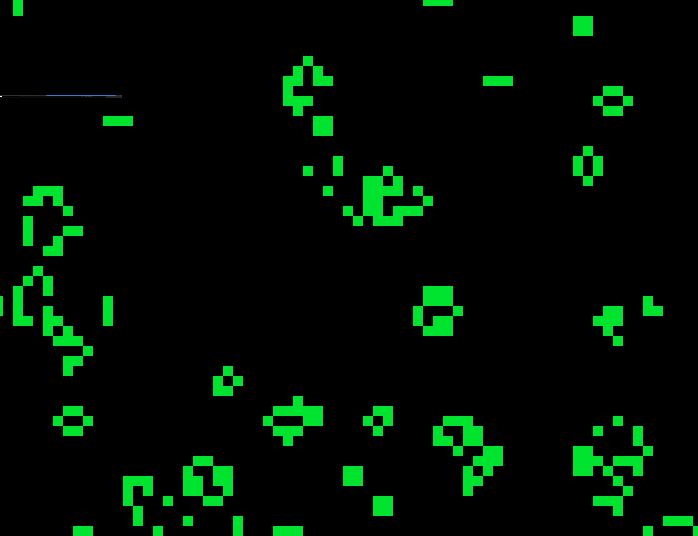

# Conway's Game of Life
Simple Conway's Game of Life implementation in [Odin](https://odin-lang.org) using [Raylib](https://raylib.com).

## Running
- Install Odin. [[Instructions](https://odin-lang.org/docs/install/)]
- Clone the GitHub repository.
```bash
// ssh
$ git clone git@github.com:furtidev/game-of-life
// https
$ git clone https://github.com/furtidev/game-of-life
```
- CD into the cloned repository: `$ cd game-of-life/`
- Run the following command: `odin run .`

## LICENSE
[MIT](./LICENSE)